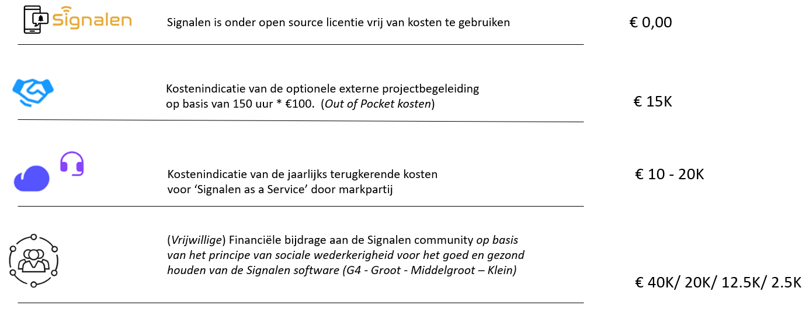

# E-mail templates

In Django kun je via _E-mail integrations > E-mail_ templates de verschillende e-mail opmaken aanpassen. De code die hiervoor gebruikt wordt is markdown language (Zie [https://commonmark.org/help/](https://commonmark.org/help/) voor een korte tutorial en opmaak).

De key in Django refereert naar een onderliggend script, een key is nodig om de juiste email in de juiste situatie te versturen. Dit houdt dus in dat je alleen maar templates kan maken als deze verbonden zijn aan een key. Zomaar een nieuw template bedenken voor een andere functie of handeling kan dus niet zomaar vanuit Django.\
\
Wanneer je een e-mail template aanmaakt of wijzigt vind je onderaan de beschikbare variabelen. Zo zijn er algemene variabelen die in iedere template te gebruiken zijn en specifieke variabelen voor een bepaalde e-mail template:

<figure><figcaption>
Algemene variabelen
</figcaption></figure>

<figure><figcaption>
Deel van template-specifieke variabelen
</figcaption></figure>

Er zijn verschillende e-mail types die verstuurd kunnen worden.

1\.  Send mail to verify the email address of a reporter

2\.  Sent mail to current reporter that a change of contact information is requested

3\.  Send mail to new reporter stating that contact information was successfully updated

4\.  Send mail when a My Signals token has been requested   &#x20;

5\.  Send mail signal assigned

6\. Send mail signal created

7\.  Send mail signal forwarded to external

8\.  Send mail forwarded to external reaction received

9\.  Send mail signal handled

10\.  Send mail signal reopened

11\.  Send mail signal scheduled

12\.  Send mail optional

13\.  Send mail signal reaction requested

14\.  Send mail signal reaction requested received

15\.  Send mail signal negative KTO contact

16\.  Send mail signal feedback received

&#x20;

·  Optional > Bij status “In afwachting van behandeling”, “In behandeling”, “Extern: verzoek tot afhandeling”, “Geannuleerd” waar je optioneel een toelichting naar melder kunt sturen

·  Created > Bevestigingsmail bij status “Gemeld”

·  Handled > afhandelingsmail bij status “Afgehandeld”

·  Scheduled > bij status “Ingepland”

·  Reopend > bij status “Heropend”

&#x20;

<mark style="background-color:red;">**Let op! De e-mail wordt uiteraard alleen verstuurd als de melder een e-mailadres heeft ingevuld.**</mark>
