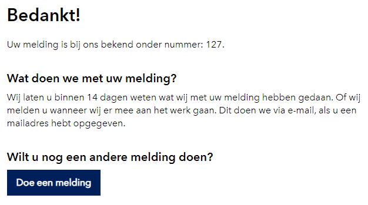

# Een melding maken

## Een melding maken \(extern\)

Inwoners kunnen een Melding Openbare Ruimte en overlast \(ook wel bekend als MORA\) maken op de website waar de front-end van Signalen geïnstalleerd is.

### Selecteren van een locatie

Het formulier biedt de mogelijkheid om een locatie te kiezen op de kaart, om een adres in te voeren of een locatie te bepalen op basis van gps.

### Bepalen van de categorie

In Signalen wordt dit automatisch gedaan op basis van de tekst die de melder invoert.

### Datum/tijd van overlast

Voor sommige categorieën meldingen is het van belang om te weten of de overlast nu ervaren wordt of dat dit in het verleden was \(met name van belang voor handhaving\). Indien gekozen wordt voor eerder dan kan er tot een week terug aangegeven worden op welk moment de overlast of andersoortige misstand ervaren werd:

### Foto kiezen

Het formulier biedt ook de mogelijkheid om drie foto’s toe te voegen.

| **!** | Momenteel is het mogelijk om maximaal 3 bestanden te uploaden. |
| :--- | :--- |

#### Vervolgvragen op basis van subcategorie

Na het automatisch bepalen van de categorie en subcategorie, kunnen gerichte vervolgvragen worden gesteld of informatie worden verstrekt. Zo kan per categorie specifieke informatie uitgevraagd worden die van belang is voor het opvolgen van dat specifieke type melding, zoals:

### Contactgegevens

In de volgende stappen van het formulier wordt gevraagd om een telefoonnummer en/of e-mailadres, beide zijn optioneel. Hierdoor kan eventueel contact opgenomen  worden met de melder indien er iets aan de melding niet duidelijk is. Een e-mailadres wordt gevraagd zodat we de melder een bevestiging van de melding kunnen sturen en per e-mail op de hoogte kunnen houden van de voortgang van het opvolgen van de melding:

Het is niet verplicht om contactgegevens op te geven. Indien de melder ervoor kiest om dit wel te doen dan zullen de persoonsgegevens standaard twee weken \(kan verschillen per gemeente\) na het afronden van de melding worden verwijderd in verband met de privacy wetgeving.

### Overzicht van de melding

Na de invoer van de benodigde gegevens krijgt de melder een overzicht van de melding te zien en kan de melder de gegevens indien gewenst nog wijzigen:

### Toestemming delen gegevens

De melder kan toestemming geven voor het delen van de gegevens met andere organisaties. De gegevens worden alleen door de gemeente gedeeld wanneer dit nodig is om de melding af te handelen.

#### Bedankt!

In de laatste stap komt de melder op de zogenoemde bedankt-pagina. Hier wordt ook verteld op welke manier en wanneer we de melding zullen opvolgen:

De tekst onder "Wat doen we met uw melding?" is per subcategorie aanpasbaar.

## Een melding maken \(voor medewerkers\)

Voor medewerkers die namens de gemeente een melding openbare ruimte invoeren is een intern meldformulier beschikbaar. Dit werkt precies hetzelfde als het publieke formulier, behalve dat er gevraagd wordt om de bron van de melding, het type melding en de urgentie. Ook is het mogelijk om de automatisch bepaalde subcategorie aan te passen:

### Bron van binnenkomst registreren

Geef hierbij aan via welke bron de melding binnenkomt.

Hieronder volgt een lijst van mogelijke bronnen. Deze bronnen kunnen per installatie/organisatie verschillen:

* Telefonisch
* E-mail
* Webcare – CCA
* Interne melding
* Meldkamer
* BuitenBeter
* VerbeterDeBuurt
* Waarnemingenapp

### Interne melding

Wanneer bij een melding een @domeinnaam adres wordt opgegeven bij de contactgegevens, zal een melding **altijd** als Interne melding worden geregistreerd. Dit is te configureren bij de installatie van Signalen \(zie Implementatie Gids\).

### Aanpassen van de subcategorie

Nadat je hebt aangegeven waar de melding over gaat, geeft Signalen aan op welke subcategorie de melding wordt gezet.

Indien dit niet de juiste subcategorie is, kan je handmatig de juiste subcategorie selecteren. Hierna worden de uitvraagpagina’s die horen bij deze subcategorie getoond.

### Type meldingen

**Melding**

Een verzoek tot herstel of handhaving om de normale situatie te herstellen \(container vol, geluidsoverlast, te hard varen, etc\).

**Aanvraag**

Een verzoek om iets structureels te veranderen \(plaatsing bankje, verplaatsen container, etc\).

**Vraag**

Een verzoek om informatie \(van wie is die camera, waarom zijn de paaltjes weggehaald, etc\).

**Klacht**

Een uiting van ongenoegen over het handelen van de gemeente.

**Groot onderhoud**

Een verzoek dat niet onder dagelijks beheer valt, maar onder een langdurig traject.

Let op! Bovenstaande type meldingen zijn voorbeelden en kunnen door de gemeente zelf vastgesteld worden.

#### Urgentie bepalen

Bij spoedeisende en/of gevaarlijke situaties kan de urgentie van de melding verhoogd worden naar Hoog. Ook kan de urgentie op Laag worden gezet.

## Een melding behandelen

### Rollen \(alleen van toepassing op gemeente Amsterdam\)

Binnen SIA zijn momenteel de volgende rollen aangemaakt:

**Monitor**

De monitor kan meldingen aanmaken en bekijken. Het behandelen van meldingen kan door deze rol niet worden uitgevoerd.

**Extern Systeem**

We hebben koppelingen met diversie externe systemen. Deze kunnen een melding bekijken, aanmaken en behandelen.

**Behandelaar**

Een behandelaar kan meldingen bekijken, afhandelen.

**Coördinator**

Een coördinator kan meldingen bekijken, wijzigen en afhandelen.

**Regievoerder**

Een regievoerder heeft voornamelijk een plaats binnen het Actie Service Centrum. De regievoerder kan meldingen bekijken, wijzigen en afhandelen van vrijwel alle diensten.

**Regievoerder+**

Met deze rol heb je naast alle “Regievoerder” rechten ook de rechten om standaard afmeldteksten binnen SIA toe te voegen.

| Rol | Monitor | Extern Systeem | Behandelaar | Coördinator | Regievoerder | Regievoerder + |
| :--- | :--- | :--- | :--- | :--- | :--- | :--- |
| Melding aanmaken | x | x | x | x | x | x |
| Melding bekijken | x | x | x | x | x | x |
| Notities bekijken / toevoegen | x | x | x | x | x | x |
| Urgentie wijzigen | x | x | x | x | x | x |
| Status wijzigen |  | x | x | x | x | x |
| Categorie wijzigen |  |  |  | x | x | x |
| Doorzetten naar THOR |  |  |  |  | x | x |
| Standaardteksten bewerken |  |  |  |  |  | x |

### Behandelschermen

Via het tabblad “Afhandelen” kom je in het overzichtsscherm van af te handelen meldingen.

Naast de lijstweergave is ook de kaartweergave mogelijk. Hier zie je standaard alle meldingen van de afgelopen 24uur op de kaart. Stel je eerst een filter in? Dan toont de kaart de resultaten van het filter op een kaart. Door op een marker te klikken kan je de desbetreffende melding openen.

### Filters

Je kan je eigen filters aanmaken en opslaan. Ga hiervoor naar ‘Filteren’, geef je filter een naam, selecteer de gewenste onderdelen en kies voor ‘Opslaan en filteren’. Hierna worden in het meldingenscherm de meldingen weergegeven binnen het opgegeven filter.

| **!** | Wanneer je bij een bepaald filteronderdeel geen selectie hebt gemaakt, wordt alles getoond. |
| :--- | :--- |
| **!** | Je maakt een nieuw filter aan door in het filterscherm linksonder op ‘Nieuw filter’ te klikken. |

Je kan op de volgende onderdelen filteren;

* **Datum;** de datum \(of datumrange\) waarop de melding is binnengekomen
* **Zoek in notitie;** zoek op tekst in het notitieveld van een melding
* **Type;** het type melding
* **Urgentie;** laag, normaal of hoog
* **Stadsdeel;** het verantwoordelijke stadsdeel
* **Categorie;** de subcategorie van de melding. Zie bijlage 3 voor een overzicht
* **Adres;** de locatie die is doorgegeven door de melder
* **Contact;** Telefoon, e-mailadres, of geen contactgegevens
* **Feedback;** de feedback van de melder
* **Bron;** het kanaal waarop de melding is binnen gekomen
* **Soort;** soort melding zoals standaardmelding, hoofdmelding of deelmelding
* **Afhandeltermijn;** welke meldingen binnen en buiten de afhandeltermijn vallen
* **Toegewezen aan;** meldingen die op naam staan van een medewerker of juist nog niet toegewezen zijn
* **Afdeling;** afdeling waar een melding aan is toegewezen
* **Status;**
  * Gemeld
  * In afwachting van behandeling
  * In behandeling
  * Ingepland
  * Afgehandeld
  * Geannuleerd
  * Heropend
  * Extern: te verzenden
  * Extern: verzonden
  * Extern: mislukt
  * Extern: afgehandeld
  * Extern: verzoek tot afhandelen
  * Gesplitst
  * Verzoek tot heropenen

| **!** | De statussen die beginnen met “Extern:” zijn alleen van toepassing als een melding automatisch wordt doorgestuurd naar een externe partij |
| :--- | :--- |

Je opgeslagen filters kan je terug vinden onder ‘Mijn filters’.

Vanuit dit scherm kan je naar het resultaat van het filter, het filter aanpassen of deze verwijderen.

### Vrij zoeken

Via de zoekbalk bovenaan je scherm kan je vrij zoeken naar meldingen. Op dit moment wordt er gezocht binnen de omschrijving, het meldingsnummer, e-mail, telefoonnummer en de subcategorie.

#### Kolommen sorteren

Door op de titel van de kolom te klikken kan je de sortering op- of aflopend instellen. Je kan op alle kolommen sorteren.

